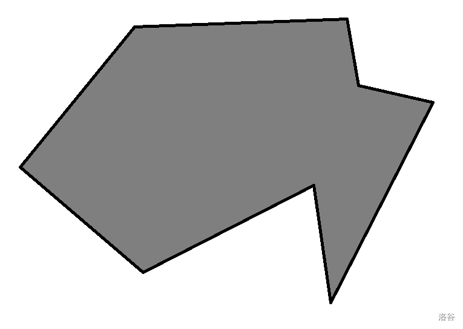
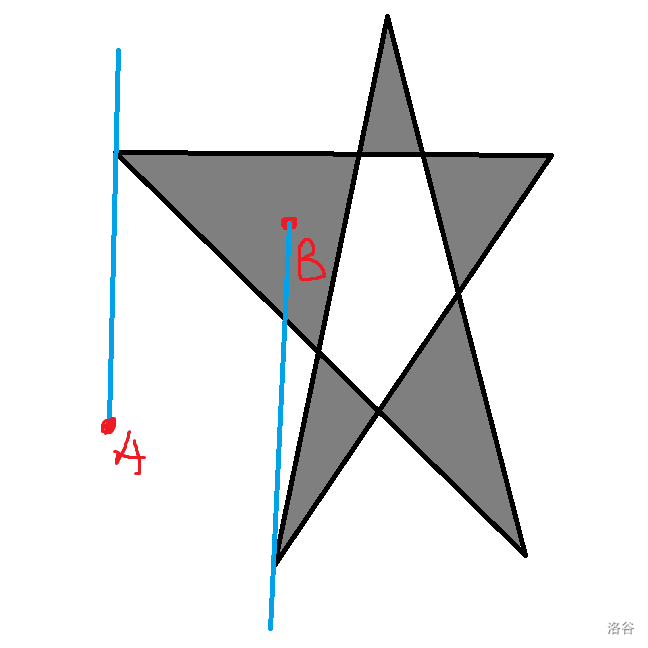
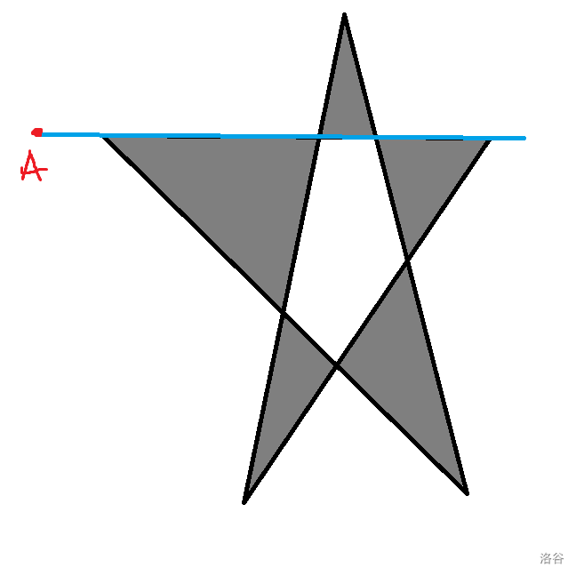

:::note

下文内容来自本人其他地方的博客，并对其进行了部分修改。

本文以下内容已经经过极多组随机数据与某篇论文（太久了，实在想不起来了）所提供std进行对拍，并未出现任何错误，可信度较高。

:::

## 题目

在网上看到了这样的一道题：

> 顺时针给出 $n$ 边形的 $n$ 个顶点，再给出一个点 $(x,y)$，判断该点是否在该多边形内部。

:::tip

对于此题我已制作题目，可以自行测试：https://www.luogu.com.cn/problem/U244855

:::

## 想法

引入一种方法：射线法。

我们任意拉一条以 $(x,y)$ 为顶点的射线，如果射线与多边形的交点个数为奇数，则在多边形内部；反之，在多边形外部。

证明：



我们随意画出了一个多边形。由于多边形的边将一张图分为了“内部”和“外部”，因此每穿过一条边就相当于从“内部”走到了“外部”，或者反之。那对于在内部的点，首先会经过一条边到达外部，再经历进入出去循环，即奇数。如果在外部，不需要出去，就直接可以经历进入出去的循环，即偶数。

这个进入出去的路径，就是随意拉的一条射线。

### 特例

但是我们会碰到几个特殊情况

- case1：引出的射线与多边形的顶点相交

  

  例如上图，如果不特判的话，如果遇到精度误差，可能会导致少算几个交点，导致答案出错

- case2：引出的射线与多边形某条边重合

  

  同样如果不特判同样也会出现问题

对于以上两种情况的解决方案是重新换一条射线，其他的方法懒得想，次数也不会很多，常数级别的，不会影响运行效率

## 代码实现

```cpp
#include<iostream>
#include<climits>
#include<cstring>
#include<cstdio>
#include<cmath>
using namespace std;

#define db double

const double eps = 1e-5;
const int maxn = 2010;

int n, q;
struct point {
	db x, y;
	point() {}
	point(db xx, db yy) {
		x = xx, y = yy;
	}
};
point pt[maxn];
struct line {
	db k, b; // 斜率与截距
	db sx, ex; // 线段在 [sx, ex] 之间
	line() {}
	line(db kk, db bb, db ssx, db eex) {
		k = kk, b = bb;
		sx = ssx, ex = eex;
	}
};
line ln[maxn];
line ray;

// 获得连接 pt1 与 pt2 的线段信息
line getLine(point pt1, point pt2) {
	line tmp;
	tmp.k = (pt1.y - pt2.y) / (pt1.x - pt2.x);
	tmp.b = pt1.y - tmp.k * pt1.x;
	tmp.sx = pt1.x;
	tmp.ex = pt2.x;
	return tmp;
}

// 判断两个 double 类型是否相等
bool equal(db a, db b) {
	return fabs(a - b) < eps;
}

// 判断 p 是否被 l 穿过
bool passPoint(line l, point p) {
	if (equal(l.k * p.x + l.b, p.y)) {
		if (l.sx > l.ex) {
			swap(l.sx, l.ex);
		}
		if (l.sx <= p.x && p.x <= l.ex) {
			return 1;
		}
	}
	return 0;
}

// 判断 ray 是否合规
bool checkERROR() {
	for (int i = 1; i <= n; i++) {
		if (passPoint(ray, pt[i])) {
			return 1;
		}
	}
	for (int i = 1; i <= n; i++) {
		if (equal(ln[i].k, ray.k) && equal(ln[i].b, ray.b)) {
			return 1;
		}
	}
	return 0;
}

// 判断 ln1 和 ln2 是否相交
bool checkInter(line ln1, line ln2) {
	point tmp;
	tmp.x = (ln2.b - ln1.b) / (ln1.k - ln2.k);
	tmp.y = ln1.k * tmp.x + ln1.b;
	return passPoint(ln1, tmp) && passPoint(ln2, tmp);
}
bool check(point a) {
	point tmp;
	do {
		tmp.x = rand() % 200;
		tmp.y = rand() % 200;
		ray = getLine(a, tmp);
		ray.ex = INT_MAX;
	} while (checkERROR());

	int cnt = 0;
	for (int i = 1; i <= n; i++) {
		if (checkInter(ln[i], ray)) {
			cnt++;
		}
	}
	return cnt % 2;
}

int main() {
	cin >> n >> q;
	for (int i = 1; i <= n; i++) {
		cin >> pt[i].x >> pt[i].y;
	}

	pt[0] = pt[n];
	for (int i = 1; i <= n; i++) { // 建出多边形的边
		point pt1 = pt[i - 1];
		point pt2 = pt[i];
		ln[i] = getLine(pt1, pt2);
	}

	while (q--) {
		point p;
		cin >> p.x >> p.y;
		if (check(p)) {
			cout << "Yes" << endl;
		}
		else {
			cout << "No" << endl;
		}
	}
	return 0;
}
```


